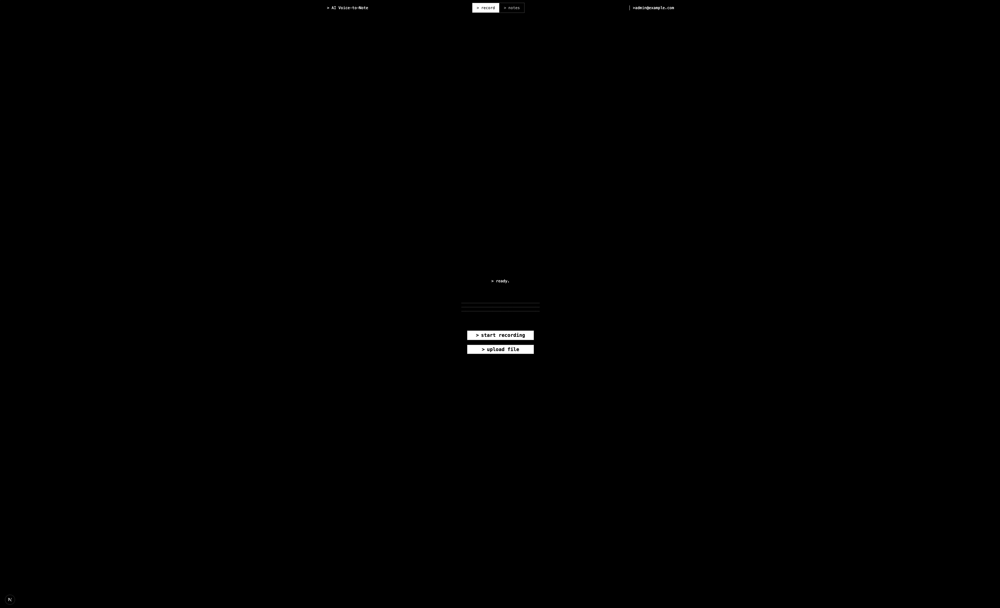

# Voice to Text

[](https://github.com/sozureke/voice-to-text/blob/main/assets/demo.mp4)

# Setup Guide

This project consists of a Next.js frontend and a Python FastAPI backend.

**Architecture:**
- **Frontend (Next.js):** Handles authentication, UI, and database operations
- **Backend (Python):** Handles all AI processing (Whisper transcription, OpenRouter summary & structuring)

## Prerequisites

- Node.js 18+ and npm/yarn
- Python 3.8+
- pip (Python package manager)

## Backend Setup

1. **Navigate to the backend directory:**
   ```bash
   cd backend
   ```

2. **Install Python dependencies:**
   ```bash
   pip install -r requirements.txt
   ```

   Note: This will install OpenAI Whisper, which requires FFmpeg. If you don't have FFmpeg installed:
   - **macOS:** `brew install ffmpeg`
   - **Linux:** `sudo apt-get install ffmpeg` (Ubuntu/Debian) or `sudo yum install ffmpeg` (CentOS/RHEL)
   - **Windows:** Download from [ffmpeg.org](https://ffmpeg.org/download.html)

3. **Set environment variables:**
   ```bash
   # Required: OpenRouter API key (for summary and structuring)
   export OPENROUTER_API_KEY=your-openrouter-api-key
   
   # Optional: Whisper model size (default: base)
   export WHISPER_MODEL_SIZE=base  # Options: tiny, base, small, medium, large
   
   # Optional: Backend port (default: 8000)
   export BACKEND_PORT=8000
   
   # Optional: CORS origins (comma-separated)
   export CORS_ORIGINS=http://localhost:3000
   
   # Optional: NextAuth URL for OpenRouter headers
   export NEXTAUTH_URL=http://localhost:3000
   ```

4. **Start the backend server:**
   ```bash
   python main.py
   ```
   
   The backend will be available at `http://localhost:8000`

## Frontend Setup

1. **Install Node.js dependencies:**
   ```bash
   npm install
   # or
   yarn install
   ```

2. **Set up environment variables:**
   Create a `.env.local` file in the root directory:
   ```env
   # Database
   DATABASE_URL="your_database_url"

   # NextAuth
   NEXTAUTH_URL="http://localhost:3000"
   NEXTAUTH_SECRET="your_secret_key"

   # Backend URL (Python backend service)
   # All AI processing (transcription, summary, structuring) happens here
   BACKEND_URL="http://localhost:8000"
   ```
   
3. **Set up the database:**
   ```bash
   npm run db:generate
   npm run db:push
   ```

4. **Start the development server:**
   ```bash
   npm run dev
   # or
   yarn dev
   ```

   The frontend will be available at `http://localhost:3000`

## Running Both Services

You need to run both the backend and frontend simultaneously:

**Terminal 1 (Backend):**
```bash
cd backend
python main.py
```

**Terminal 2 (Frontend):**
```bash
npm run dev
```

## Troubleshooting

### Backend Issues

- **FFmpeg not found:** Make sure FFmpeg is installed and available in your PATH
- **Model loading fails:** Check your internet connection (first run downloads the model)
- **Port already in use:** Change `BACKEND_PORT` environment variable

### Frontend Issues

- **Cannot connect to backend:** 
  - Ensure the backend is running on the port specified in `BACKEND_URL`
  - Check CORS configuration in `backend/main.py`
- **Transcription fails:** 
  - Verify the backend is running and accessible
  - Check backend logs for errors

## Model Sizes

Whisper model sizes (choose based on your needs):
- `tiny`: Fastest, least accurate (~39M parameters)
- `base`: Good balance, recommended (~74M parameters) - **Default**
- `small`: Better accuracy (~244M parameters)
- `medium`: High accuracy (~769M parameters)
- `large`: Best accuracy, slowest (~1550M parameters)

For most use cases, `base` or `small` provides a good balance of speed and accuracy.
